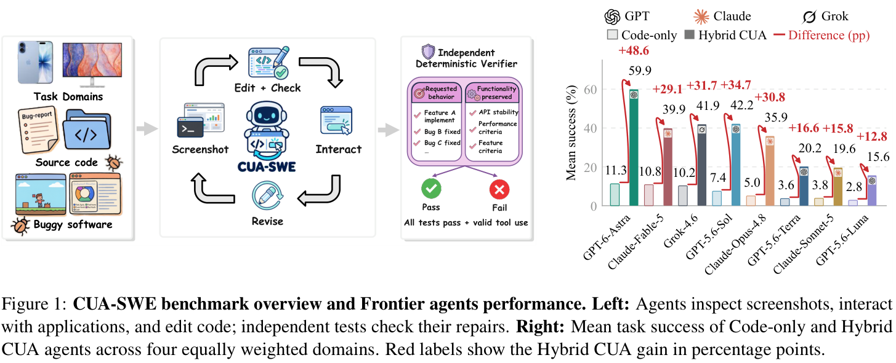
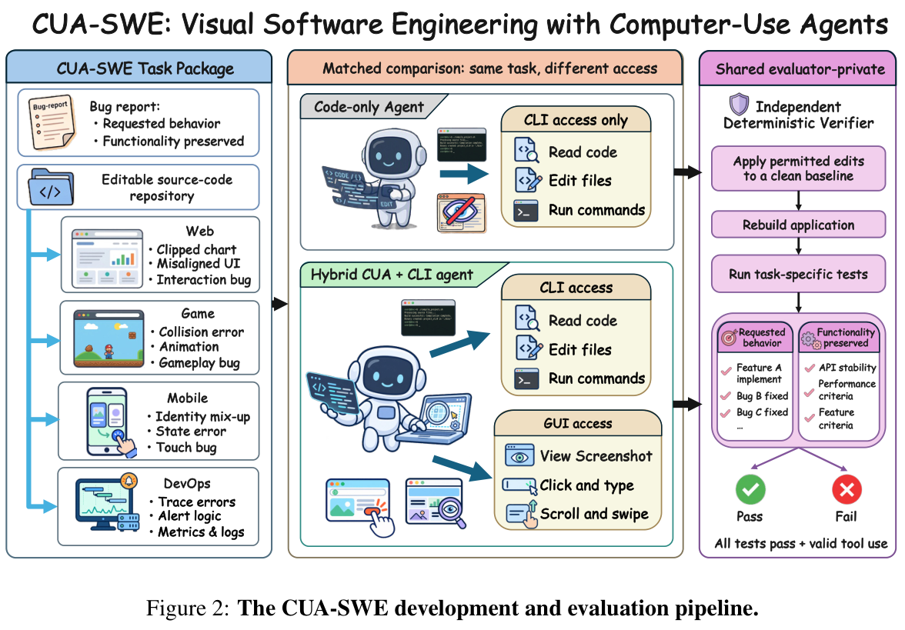

<div align="center">

# CUA-SWE

### When Computer-Use Agents Meet Visual Software Engineering

[](https://zelongxueric.github.io/cua-swe-website/)
[](https://arxiv.org/abs/2609.32600)
[](https://arxiv.org/pdf/2609.32600)
[](https://huggingface.co/datasets/kingofspace0wzz/CUA-SWE)
[](https://kingofspace0wzz.github.io/cua-swe-viewer/)
[](#leaderboard)

**105 tasks · 4 domains · Code editing + computer use · Deterministic verification**

[Benchmark](#the-benchmark) · [Quick start](#quick-start) · [API providers](#choose-your-api-provider) · [Evaluation](#run-and-evaluate) · [Roadmap](#roadmap) · [Citation](#citation)

</div>

CUA-SWE evaluates whether agents can develop software by **using the software they edit**. Agents inspect running applications, discover visual requirements and runtime failures, change the source, and test their changes through computer use. Independent verifiers check the requested behavior and existing functionality.



## News

- **CUA-SWE 1.0 is available:** benchmark tasks, application environments, evaluation pipelines, and baseline results across four domains.
- **September 2026:** [paper](https://arxiv.org/abs/2609.32600), [project website](https://zelongxueric.github.io/cua-swe-website/), [Hugging Face dataset](https://huggingface.co/datasets/kingofspace0wzz/CUA-SWE), and [interactive data browser](https://kingofspace0wzz.github.io/cua-swe-viewer/) released.

## Roadmap

- [x] **CUA-SWE 1.0:** release the benchmark, task environments, domain evaluation pipelines, and baseline results.
- [x] **Multiple API interfaces:** Responses, Chat Completions, Anthropic Messages, and Amazon Bedrock.
- [ ] **More domain tasks:** continue integrating new applications, task families, and domains.
- [ ] **Post-training RLVR environment:** release environments and verifiable rewards for reinforcement learning with verifiable rewards.

Follow releases on [GitHub](https://github.com/kingofspace0wzz/cua-swe/releases), and share task contributions or integration requests through [Issues](https://github.com/kingofspace0wzz/cua-swe/issues).

## The benchmark

| Domain | Tasks | What agents work on | Task manifest |
| --- | ---: | --- | --- |
| **Web** | 36 | Interactive editors, charts, maps, layout, and application workflows | [Web36](dataset/web/manifest.yaml) |
| **Game** | 29 | Gameplay, physics, state transitions, and interaction regressions across 12 games | [Game29](dataset/game/manifest.yaml) |
| **Mobile** | 20 | Mobile-web applications with visual requirements and touch interactions | [Mobile20](dataset/mobile/manifest.json) |
| **DevOps** | 20 | Monitoring, dashboards, alerting, configuration, and observability | [DevOps20](dataset/devops/manifest.yaml) |

Each task provides an instruction, editable source, an application environment, and independent verification. The evaluator prepares the workspace, runs the agent, extracts its changes, and scores the resulting application. In **CUA** mode, agents also receive screenshots and graphical actions; **code-only** mode provides source and terminal tools.



## Leaderboard

**Latest published results: September 24, 2026.** Single-attempt task success (%). Each cell shows **code-only → CUA**; bold marks the best CUA score in each domain.

<!-- leaderboard:start -->
| Model / agent | Web (36) | Game (29) | DevOps (20) | Mobile (20) |
| --- | ---: | ---: | ---: | ---: |
| GPT-6 Astra (API) | 27.8 → **66.7** | 17.2 → **37.9** | 0.0 → **80.0** | 0.0 → **55.0** |
| GPT-5.6 Sol (API) | 19.4 → 58.3 | 10.3 → 10.3 | 0.0 → 55.0 | 0.0 → 45.0 |
| GPT-5.6 Luna (API) | 11.1 → 5.6 | 0.0 → 6.9 | 0.0 → 15.0 | 0.0 → 35.0 |
| GPT-5.6 Terra (API) | 11.1 → 13.9 | 3.4 → 6.9 | 0.0 → 25.0 | 0.0 → 35.0 |
| Claude Opus 5 (API) | 22.2 → 55.6 | 13.8 → 20.7 | 0.0 → 60.0 | deferred → deferred |
| Claude Opus 4.8 (API) | 16.7 → 27.8 | 3.4 → 20.7 | 0.0 → 55.0 | 0.0 → 40.0 |
| Claude Sonnet 5 (API) | 8.3 → 0.0 | 6.9 → 3.4 | 0.0 → 40.0 | 0.0 → 35.0 |
| Claude Fable 5 (API) | 19.4 → 47.2 | 13.8 → 17.2 | 5.0 → 55.0 | 5.0 → 40.0 |
| Grok 4.6 (API) | 30.6 → 55.6 | 10.3 → 17.2 | 0.0 → 65.0 | 0.0 → 30.0 |
| Codex + Sol | — → 55.6 | — → 17.2 | — → 55.0 | — → 40.0 |
| Claude Code + Opus 5 | — → 55.6 | — → 20.7 | — → 65.0 | — → deferred |
<!-- leaderboard:end -->

**—**: no reported result. **Deferred**: evaluation postponed. Scores use the task count and scoring policy of each domain.

[Full results and repeated-attempt evaluations](results/README.md) · [JSON](results/paper-results.json) · [CSV](results/leaderboard.csv) · [Scoring details](docs/results.md)

## Quick start

Use a Linux host with **Python 3.11+**, Git, Node/npm, `bubblewrap`, `strace`, and a C compiler. Use Node 22.22.2+ for Web and DevOps. Game tasks use system Node 18 and Java 17. Create the Python environment outside the repository so it can be mounted independently in task sandboxes. The [environment guide](docs/evaluation.md#host-setup) describes runtime setup.

```bash
git clone https://github.com/kingofspace0wzz/cua-swe.git
cd cua-swe
python3 -m venv "$HOME/.venvs/cua-swe"
source "$HOME/.venvs/cua-swe/bin/activate"
python -m pip install -e '.[evaluation]'

# Ubuntu 24.04 sandbox and browser-launcher dependencies.
sudo apt-get update
sudo apt-get install -y bubblewrap strace build-essential git openjdk-17-jre-headless
PLAYWRIGHT_SKIP_BROWSER_GC=1 python -m playwright install --with-deps chromium

# The TaskBundle runner uses this package for its runtime/audit bootstrap.
npm install --prefix "$VIRTUAL_ENV/agent-tools" --install-strategy=nested @openai/codex@0.146.0
export PATH="$VIRTUAL_ENV/agent-tools/node_modules/.bin:$PATH"

# Check all 105 tasks, their input files, and the evaluation source.
python scripts/check_release.py
```

## Choose your API provider

The public evaluator accepts **your endpoint's model ID** with four API interfaces. Models used in CUA mode need image input and function calling. Set `MODEL` and choose one `API` configuration below; use it with any domain command in the next section. Examples use Bash arrays.

```bash
export MODEL="your-model-id"
```

### OpenAI Responses

```bash
export OPENAI_API_KEY="your-api-key"
API=(--provider responses --model "$MODEL")
```

The default base URL is `https://api.openai.com/v1`. Add `--base-url "$API_BASE_URL"` for a Responses-compatible endpoint and `--api-key-env YOUR_KEY_VARIABLE` to select its credential variable.

### OpenAI-compatible Chat Completions

For OpenAI, or a compatible hosted service, set the service's API base URL and credential:

```bash
export API_BASE_URL="https://api.openai.com/v1"
export MODEL_API_KEY="your-api-key"
API=(--provider chat-completions --model "$MODEL"
     --base-url "$API_BASE_URL" --api-key-env MODEL_API_KEY)
```

For a local server such as vLLM or SGLang, use its served model name and a tool-calling configuration for that model:

```bash
API=(--provider chat-completions --model "$MODEL"
     --base-url http://127.0.0.1:8000/v1 --api-key-env NONE)
```

### Claude API (Anthropic Messages)

```bash
export ANTHROPIC_API_KEY="your-api-key"
API=(--provider anthropic --model "$MODEL")
```

This calls Claude directly through Anthropic's Messages API at
`https://api.anthropic.com/v1/messages`. Set `MODEL` to a Claude model ID available
to your Anthropic account. The default base URL is `https://api.anthropic.com/v1`;
compatible Messages endpoints can be selected with `--base-url` and
`--api-key-env`.

### Amazon Bedrock

Use a Bedrock API key, a region available to your account, and a model ID or inference-profile ID supported by **Converse**:

```bash
export AWS_REGION="your-aws-region"
export AWS_BEARER_TOKEN_BEDROCK="your-bedrock-api-key"
API=(--provider bedrock --model "$MODEL" --region "$AWS_REGION")
```

This uses the standard `bedrock-runtime` **Converse** endpoint with API-key authentication. For models served through Bedrock's OpenAI-compatible interface:

```bash
API=(--provider chat-completions --model "$MODEL"
     --base-url "https://bedrock-runtime.${AWS_REGION}.amazonaws.com/openai/v1"
     --api-key-env AWS_BEARER_TOKEN_BEDROCK)
```

See the [provider guide](docs/providers.md) for endpoint conventions, Bedrock Mantle compatibility, request limits, and adapter details.

## Run and evaluate

`plan` prints the selected tasks and configuration. `run` executes **one attempt per task**, including workspace setup, agent interaction, and final verification. `--scope gate` selects the first 10 tasks; `--scope full` selects the whole domain. Use a new output directory for each run.

### Web

Start with one task, then evaluate the full 36-task collection:

```bash
python scripts/run_evaluation.py plan --domain web --scope gate "${API[@]}"

python scripts/run_evaluation.py run --domain web "${API[@]}" \
  --task-id web.maplibre-reset-touch-reacquisition.001 --condition cua \
  --output-root "$PWD/artifacts/web-single"

python scripts/run_evaluation.py run --domain web --scope full "${API[@]}" \
  --condition cua --output-root "$PWD/artifacts/web-cua"
```

### Game

```bash
python scripts/run_evaluation.py run --domain game --scope full "${API[@]}" \
  --condition cua --output-root "$PWD/artifacts/game-cua"
```

### DevOps

```bash
python scripts/run_evaluation.py run --domain devops --scope full "${API[@]}" \
  --condition cua --output-root "$PWD/artifacts/devops-cua"
```

### Mobile

Generate a runtime configuration using the active Python environment, installed Chromium, and `bubblewrap`, then run the 20-task collection:

```bash
python scripts/configure_mobile_runtime.py \
  --output mobile-runtime-config.local.json \
  --output-root "$PWD/artifacts/mobile"

python scripts/run_evaluation.py run --domain mobile --scope full "${API[@]}" \
  --condition cua --runtime-config mobile-runtime-config.local.json \
  --output-root "$PWD/artifacts/mobile/cua"
```

The Mobile evaluator runs baseline and reference controls, executes the agent against the mobile application, and grades its submitted changes. It records the installed browser's identity and the task's release lineage. Its default budget is **60 model responses and 45 active minutes per task**.

### Code-only comparison and result files

Switch to `--condition code-only` to run the same model with source and terminal tools:

```bash
python scripts/run_evaluation.py run --domain web --scope full "${API[@]}" \
  --condition code-only --output-root "$PWD/artifacts/web-code-only"
```

| Output, relative to `--output-root` | Contents |
| --- | --- |
| `evaluation.json` | Selected manifest/tasks, provider, model, condition, and evaluator extension hashes |
| `runner/summary.json` | Web, Game, and DevOps trial summaries |
| `runner/canonical-web-results.json` | Web native verifier outcomes and reported success |
| `runner/trials/` | TaskBundle patches, verification, trajectories, screenshots, and protocol audits |
| `summary.json` / `attempts/` | Mobile aggregate results and per-task controls, traces, patches, and grading |
| `completion.json` | Evaluator process exit status |

For TaskBundle runs, read task success together with protocol compliance and infrastructure status. Mobile reports `selected`, `scorable`, `successes`, `excluded`, and `success_rate`; the latter is `successes / scorable`. Report results separately for each domain and condition. [Evaluation details](docs/evaluation.md) explain the output fields and paper-baseline commands.

### Bring your own agent

The commands above run your chosen model with CUA-SWE's tool-using baseline agent. To integrate your own agent loop or CLI, use the [agent integration guide](docs/agents.md): it describes the source workspace, tool interfaces, launch contract, transcript format, and scoring handoff. The public provider implementation is a working example in [`scripts/provider_client.py`](scripts/provider_client.py).

## Citation

```bibtex
@article{wang2026cuaswe,
  title={CUA-SWE: When Computer-Use Agents Meet Visual Software Engineering},
  author={Wang, Prince Zizhuang and Liang, Chenhao and Xu, Zelong and Yuan, Aojie and Zhou, Xiaolin and Zhang, Haiyue and Zhao, Yue and Hu, Xiyang and Jiang, Shuli},
  journal={arXiv preprint arXiv:2609.32600},
  year={2026}
}
```

[Licensing](docs/release.md#license-status) · [Third-party notices](THIRD_PARTY_NOTICES.md) · [Release details](docs/release.md)
